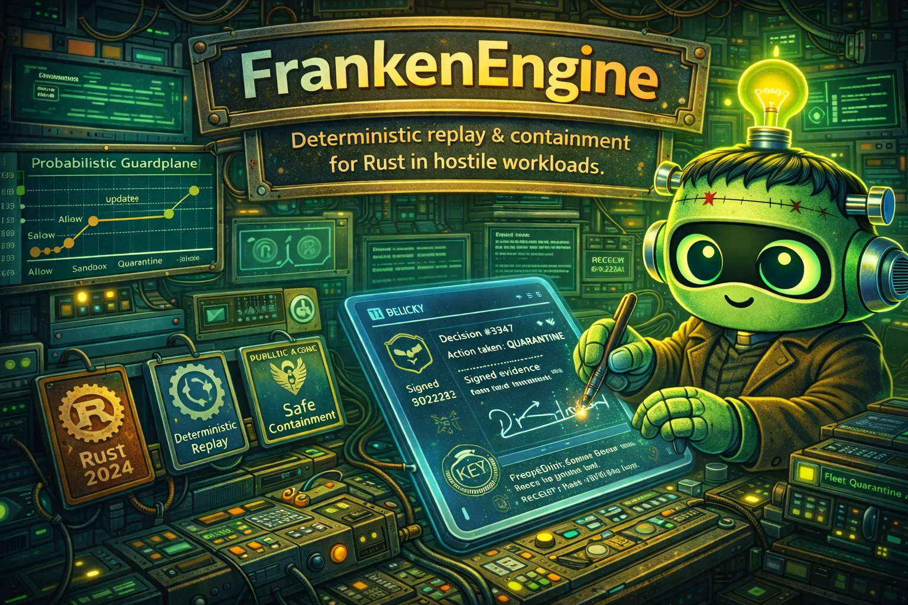

# FrankenEngine

<div align="center">
  
</div>

<div align="center">

[](https://www.rust-lang.org/)
[](https://doc.rust-lang.org/reference/unsafe-keyword.html)
[](./PLAN_TO_CREATE_FRANKEN_ENGINE.md)
[](./LICENSE)

</div>

Native Rust runtime for adversarial extension workloads, with deterministic replay, cryptographic decision receipts, and fleet-scale containment.

<div align="center">
<h3>Quick Install</h3>

```bash
curl -fsSL "https://raw.githubusercontent.com/Dicklesworthstone/franken_engine/main/install.sh?$(date +%s)" | bash
```

<p><em>Linux, macOS, and Windows support with architecture-aware binaries.</em></p>
</div>

---

## TL;DR

### The Problem
Node and Bun are fast enough for many workloads, but extension-heavy agent systems need a different default posture: active containment, deterministic forensics, and explicit runtime authority boundaries.

### The Solution
FrankenEngine provides two native execution lanes, a probabilistic guardplane with expected-loss actioning, deterministic replay for high-severity decisions, and signed evidence contracts for every high-impact containment event.

### Why Use FrankenEngine?

| Capability | What You Get In Practice |
|---|---|
| Native dual-lane execution | `quickjs_inspired_native` for deterministic control paths and `v8_inspired_native` for throughput-heavy paths |
| Probabilistic Guardplane | Bayesian risk updates and e-process boundaries that trigger `allow/challenge/sandbox/suspend/terminate/quarantine` |
| Deterministic replay | Bit-stable replay for high-severity decision paths with counterfactual policy simulation |
| Cryptographic governance | Signed decision receipts with transparency-log proofs and optional TEE attestation bindings |
| Fleet immune system | Quarantine and revocation propagation with bounded convergence SLOs |
| Capability-typed execution | TS-first workflow that compiles to capability-typed IR with ambient-authority rejection |
| Cross-repo constitution | Control plane on `/dp/asupersync`, TUI on `/dp/frankentui`, SQLite on `/dp/frankensqlite` |
| Evidence-first operations | Every published performance and security claim ships with reproducible artifact bundles |

## Quick Example

```bash
# 1) Install and verify
frankenctl version

# 2) Initialize a runtime workspace
frankenctl init --profile secure --path ./demo-runtime

# 3) Compile an extension package to capability-typed IR
frankenctl ext compile ./examples/weather-ext --out ./build/weather.fir

# 4) Run in shadow mode with lockstep Node/Bun diff
frankenctl shadow-run ./build/weather.fir --lockstep node,bun --report ./artifacts/shadow.json

# 5) Promote to active with signed policy checkpoint
frankenctl promote ./build/weather.fir --policy ./policies/default.toml --checkpoint-sign

# 6) Trigger an incident drill and inspect containment action
frankenctl drill run suspicious-exfiltration --target weather-ext
frankenctl decision show --last --explain --receipt

# 7) Verify receipt and replay deterministically
frankenctl receipt verify --id $(frankenctl decision show --last --json | jq -r .receipt_id)
frankenctl replay run --trace $(frankenctl decision show --last --json | jq -r .trace_id)
```

## Design Philosophy

1. **Runtime ownership over wrappers**
FrankenEngine owns parser-to-scheduler semantics in Rust. Compatibility is a product layer in `franken_node`, not a hidden wrapper around third-party engines.

2. **Security and performance as co-equal constraints**
The project does not trade correctness for speed or speed for policy theater. Optimizations ship with behavior proofs and rollback artifacts.

3. **Deterministic first, adaptive second**
Live decisions must replay deterministically from fixed artifacts. Adaptive learning is allowed, but only through signed promoted snapshots.

4. **Evidence before claims**
Benchmarks, containment metrics, and policy assertions are tied to reproducible artifacts. No artifact, no claim.

5. **Constitutional integration**
FrankenEngine reuses stronger sibling substrates instead of rebuilding them: asupersync control contracts, frankentui operator surfaces, and frankensqlite persistence.

## Runtime Charter

Runtime governance and native-only execution boundaries are defined in [`docs/RUNTIME_CHARTER.md`](./docs/RUNTIME_CHARTER.md).

Donor-harvesting governance boundaries (semantic extraction allowlist + architectural denylist) are defined in [`docs/DONOR_EXTRACTION_SCOPE.md`](./docs/DONOR_EXTRACTION_SCOPE.md).

Semantic compatibility source-of-truth entries for donor-observable behavior are defined in [`docs/SEMANTIC_DONOR_SPEC.md`](./docs/SEMANTIC_DONOR_SPEC.md).

Native architecture synthesis derived from that semantic contract is defined in [`docs/architecture/frankenengine_native_synthesis.md`](./docs/architecture/frankenengine_native_synthesis.md).

This charter is the acceptance gate for architecture changes and codifies:
- native Rust ownership of core execution semantics
- prohibition of binding-led core execution backends
- deterministic replay + evidence-linkage obligations for high-impact actions
- binding claim-language policy tied to reproducible artifact state
- repository split and sibling-reuse constraints

Reproducibility bundle templates (`env.json`, `manifest.json`, `repro.lock`) are defined in [`docs/REPRODUCIBILITY_CONTRACT.md`](./docs/REPRODUCIBILITY_CONTRACT.md) and shipped under [`docs/templates/`](./docs/templates/).

## Comparison

| Dimension | FrankenEngine | Node.js | Bun |
|---|---|---|---|
| Core execution ownership | Native Rust lanes | V8 embedding | JavaScriptCore + Zig runtime |
| Deterministic replay for high-severity decisions | Built in, mandatory release gate | External tooling only | External tooling only |
| Probabilistic containment policy | Built in guardplane | Not default runtime behavior | Not default runtime behavior |
| Cryptographic decision receipts | First-class runtime artifact | Not a core runtime primitive | Not a core runtime primitive |
| Fleet quarantine convergence model | Explicit SLO + fault-injection gates | App-specific integration | App-specific integration |
| Capability-typed extension contract | Native IR contract | Not native to runtime | Not native to runtime |
| Cross-runtime lockstep oracle | Built in Node/Bun differential harness | N/A | N/A |

## Installation

### Option 1: One-Line Installer

```bash
curl -fsSL "https://raw.githubusercontent.com/Dicklesworthstone/franken_engine/main/install.sh" | bash
```

### Option 2: Cargo

```bash
cargo install frankenengine-cli
```

### Option 3: Build From Source

```bash
git clone https://github.com/Dicklesworthstone/franken_engine.git
cd franken_engine
cargo build --release --workspace
./target/release/frankenctl version
```

### Optional Operator Stack

```bash
# Required for advanced TUI views
cd /dp/frankentui && cargo build --release

# Required for SQLite-backed replay/evidence stores
cd /dp/frankensqlite && cargo build --release
```

## Quick Start

1. **Create config and keys**
```bash
frankenctl init --profile secure --path ./runtime
frankenctl keys generate --out ./runtime/keys
```

2. **Enable control plane integration**
```bash
frankenctl control-plane bind --asupersync /dp/asupersync
```

3. **Compile and validate extension package**
```bash
frankenctl ext compile ./examples/hello-ext --out ./runtime/ext/hello.fir
frankenctl ext verify ./runtime/ext/hello.fir
```

4. **Run guarded runtime**
```bash
frankenctl run --config ./runtime/franken-engine.toml
```

5. **Inspect decisions and evidence**
```bash
frankenctl decision tail --follow
frankenctl evidence export --since 1h --out ./artifacts/evidence.jsonl
```

6. **Test deterministic replay and revocation paths**
```bash
frankenctl replay run --trace latest
frankenctl revocation drill --scenario stale-head-recovery
```

## Command Reference

| Command | Purpose | Example |
|---|---|---|
| `frankenctl init` | Create runtime workspace and default config | `frankenctl init --profile secure --path ./runtime` |
| `frankenctl run` | Start runtime with configured lanes and guardplane | `frankenctl run --config ./runtime/franken-engine.toml` |
| `frankenctl ext compile` | Compile TS extension package to capability-typed IR | `frankenctl ext compile ./ext/foo --out ./build/foo.fir` |
| `frankenctl ext verify` | Validate capability declarations and IR invariants | `frankenctl ext verify ./build/foo.fir` |
| `frankenctl shadow-run` | Run observe-only with lockstep differential analysis | `frankenctl shadow-run ./build/foo.fir --lockstep node,bun` |
| `frankenctl promote` | Promote extension after shadow/conformance gates | `frankenctl promote ./build/foo.fir --checkpoint-sign` |
| `frankenctl decision show` | Inspect last decision with posterior and loss terms | `frankenctl decision show --last --explain` |
| `frankenctl receipt verify` | Verify cryptographic receipt and log consistency | `frankenctl receipt verify --id rcpt_01J...` |
| `frankenctl replay run` | Deterministically replay incident trace | `frankenctl replay run --trace trace_01J...` |
| `frankenctl quarantine` | Trigger containment action for extension/session | `frankenctl quarantine --extension foo --reason high-risk` |
| `frankenctl revocation` | Manage revocation heads and propagation checks | `frankenctl revocation status --zone prod-us-east` |
| `frankenctl benchmark` | Run category benchmark and emit reproducible artifacts | `frankenctl benchmark run --suite extension-heavy` |
| `frankenctl lockstep` | Execute Node/Bun/FrankenEngine differential harness | `frankenctl lockstep run --suite compat-smoke` |
| `frankenctl tui` | Open advanced operator console via frankentui | `frankenctl tui --view incident-replay` |
| `frankenctl api serve` | Expose control APIs for operations and automation | `frankenctl api serve --bind 127.0.0.1:8787` |

## Configuration

`franken-engine.toml`

```toml
# Runtime identity and environment
[runtime]
cluster = "prod"
zone = "us-east-1"
mode = "secure"

# Select execution lanes and router policy
[lanes]
default = "hybrid_router"
quickjs_inspired_native_enabled = true
v8_inspired_native_enabled = true

[router]
policy = "risk_aware"
fallback_lane = "quickjs_inspired_native"

# Guardplane decision settings
[guardplane]
enabled = true
posterior_model = "bayes-online-v1"
sequential_test = "e_process"

[guardplane.loss]
allow = 0
warn = 5
challenge = 15
sandbox = 30
suspend = 60
terminate = 90
quarantine = 100

# Cryptographic decision receipts
[receipts]
enabled = true
transparency_log = "sqlite"
require_signature = true

# Optional TEE attestation binding for high-impact actions
[receipts.attestation]
enabled = true
min_quote_freshness_seconds = 300
fail_mode = "safe"

# Deterministic replay requirements
[replay]
enabled = true
record_randomness_transcript = true
require_snapshot_signature = true

# Control-plane substrate from asupersync
[control_plane]
provider = "asupersync"
path = "/dp/asupersync"
require_cx_threading = true
require_cancel_drain_finalize = true

# SQLite-backed persistence via frankensqlite
[storage]
provider = "frankensqlite"
path = "/var/lib/franken_engine/runtime.db"
wal_mode = true

# See docs/adr/ADR-0004-frankensqlite-reuse-scope.md for required
# SQLite substrate scope, WAL/PRAGMA ownership, and exception process.
# See docs/FRANKENSQLITE_PERSISTENCE_INVENTORY.md for store-by-store
# mapping (replay/evidence/benchmark/policy/witness/lineage/provenance/specialization).

# Operator TUI surfaces via frankentui
[ui]
provider = "frankentui"
default_view = "control-dashboard"

# See docs/adr/ADR-0003-frankentui-reuse-scope.md for advanced
# operator-surface scope and exception handling.

# API layer conventions from fastapi_rust
[api]
enabled = true
bind = "127.0.0.1:8787"
transport = "http"

# See docs/adr/ADR-0002-fastapi-rust-reuse-scope.md for required
# reuse boundaries and approved exception process.

# Scheduler and resource governance
[scheduler]
lanes = ["cancel", "timed", "ready", "background"]
default_cpu_budget_millis = 50
default_memory_budget_mb = 128
```

## Architecture

```text
                    +-----------------------------------+
                    |           franken_node            |
                    |  compatibility + product surface  |
                    +----------------+------------------+
                                     |
                                     v
+-------------------------------------------------------------------+
|                           FrankenEngine                            |
|                                                                   |
|  +-------------------+      +----------------------------------+  |
|  | Native Data Plane |      |  Control Plane (Constitutional) |  |
|  |-------------------|      |----------------------------------|  |
|  | parser + IR       |      | Cx capability contracts          |  |
|  | execution lanes   |<---->| decision contracts               |  |
|  | GC + scheduler    |      | evidence + receipts              |  |
|  | module runtime    |      | cancel -> drain -> finalize      |  |
|  +-------------------+      +----------------------------------+  |
|            |                                   |                  |
+------------+-----------------------------------+------------------+
             |                                   |
             v                                   v
  +---------------------+             +--------------------------+
  | /dp/frankensqlite   |             | /dp/frankentui          |
  | replay/evidence DB  |             | operator dashboards/TUI |
  +---------------------+             +--------------------------+
             |
             v
  +---------------------+
  | /dp/asupersync      |
  | kernel/decision/    |
  | evidence/frankenlab |
  +---------------------+
```

## Deterministic E2E Harness

`bd-8no5` establishes a deterministic harness substrate in `crates/franken-engine/src/e2e_harness.rs` with replay verification, structured-log assertions, artifact collection, and signed golden-update metadata.

Run harness checks/tests through `rch` (CPU-intensive commands are offloaded):

```bash
# check test targets for frankenengine-engine
./scripts/run_deterministic_e2e_harness.sh check

# run deterministic harness integration tests
./scripts/run_deterministic_e2e_harness.sh test

# strict lint pass for harness test target
./scripts/run_deterministic_e2e_harness.sh clippy

# CI shortcut (check + test)
./scripts/run_deterministic_e2e_harness.sh ci
```

Each invocation emits deterministic lane artifacts under
`artifacts/deterministic_e2e_harness/<timestamp>/`:
- `run_manifest.json` (trace/decision/policy IDs + deterministic environment + replay command)
- `events.jsonl` (structured lane completion event)
- `commands.txt` (exact executed command transcript)

Create a signed golden-update artifact when intentionally accepting an output digest change:

```bash
./scripts/sign_e2e_golden_update.sh \
  --fixture-id minimal-fixture \
  --previous-digest 2f1a... \
  --next-digest 9b4e... \
  --run-id run-minimal-fixture-9b4e... \
  --signer maintainer@franken.engine \
  --signature sig:deadbeef \
  --rationale "policy update changed expected event stream"
```

The command writes a deterministic JSON artifact under
`crates/franken-engine/tests/artifacts/golden-updates/`.

## Parser Phase0 Gate

`bd-3spt` parser phase0 gate validates scalar-reference parser determinism, semantic fixture hashes, and artifact-bundle generation.

```bash
# parser phase0 CI gate (check + focused parser tests + artifact bundle)
./scripts/run_parser_phase0_gate.sh ci
```

Grammar-closure backlog contract (`bd-2mds.1.1.1`) is tracked in
[`docs/PARSER_GRAMMAR_CLOSURE_BACKLOG.md`](./docs/PARSER_GRAMMAR_CLOSURE_BACKLOG.md)
with machine-checked catalog + replay coverage in:
- `crates/franken-engine/tests/fixtures/parser_grammar_closure_backlog.json`
- `crates/franken-engine/tests/parser_grammar_closure_backlog.rs`

Normative/adversarial corpus expansion + deterministic reducer promotion policy
(`bd-2mds.1.1.4`) is tracked in
[`docs/PARSER_GRAMMAR_CLOSURE_BACKLOG.md`](./docs/PARSER_GRAMMAR_CLOSURE_BACKLOG.md)
with contract vectors in:
- `crates/franken-engine/tests/fixtures/parser_phase0_semantic_fixtures.json`
- `crates/franken-engine/tests/fixtures/parser_phase0_adversarial_fixtures.json`
- `crates/franken-engine/tests/fixtures/parser_reducer_promotion_policy.json`
- `crates/franken-engine/tests/parser_corpus_promotion_policy.rs`
- `scripts/run_parser_reducer_promotion_gate.sh` + `scripts/e2e/parser_reducer_promotion_replay.sh`

Canonical AST schema/hash contract (`bd-2mds.1.1.2`) is tracked in
[`docs/PARSER_CANONICAL_AST_SCHEMA.md`](./docs/PARSER_CANONICAL_AST_SCHEMA.md)
with compatibility vectors in:
- `crates/franken-engine/tests/parser_trait_ast.rs`
- `crates/franken-engine/tests/ast_integration.rs`

Canonical Parse Event IR schema/hash contract (`bd-2mds.1.4.1`) is tracked in
[`docs/PARSER_EVENT_IR_SCHEMA.md`](./docs/PARSER_EVENT_IR_SCHEMA.md)
with compatibility vectors in:
- `crates/franken-engine/src/parser.rs` (unit coverage for schema + deterministic event emission)
- `crates/franken-engine/tests/parser_trait_ast.rs`

Deterministic event->AST materializer contract (`bd-2mds.1.4.3`) is tracked in
[`docs/PARSER_EVENT_IR_SCHEMA.md`](./docs/PARSER_EVENT_IR_SCHEMA.md)
with compatibility vectors and replay lane artifacts in:
- `crates/franken-engine/src/parser.rs` (materializer core + stable node-id witness generation)
- `crates/franken-engine/tests/parser_trait_ast.rs` (event->AST parity/tamper/replay vectors)
- `scripts/run_parser_event_materializer_lane.sh` + `scripts/e2e/parser_event_materializer_replay.sh` (structured lane manifests/events)

Core event->AST equivalence harness + deterministic replay contract (`bd-2mds.1.4.4.1`)
is tracked in
[`docs/PARSER_EVENT_AST_EQUIVALENCE_REPLAY_CONTRACT.md`](./docs/PARSER_EVENT_AST_EQUIVALENCE_REPLAY_CONTRACT.md)
with fixture-driven vectors and lane artifacts in:
- `crates/franken-engine/tests/fixtures/parser_event_ast_equivalence_v1.json`
- `crates/franken-engine/tests/parser_event_ast_equivalence.rs`
- `scripts/run_parser_event_ast_equivalence.sh` + `scripts/e2e/parser_event_ast_equivalence_replay.sh`

Canonical parser diagnostics taxonomy + normalization contract (`bd-2mds.1.1.3`)
is tracked in
[`docs/PARSER_DIAGNOSTICS_TAXONOMY.md`](./docs/PARSER_DIAGNOSTICS_TAXONOMY.md)
with compatibility vectors in:
- `crates/franken-engine/src/parser.rs` (taxonomy + normalized envelope unit coverage)
- `crates/franken-engine/tests/parser_trait_ast.rs` (metadata stability + pinned normalized-diagnostic hashes)

Byte-classification + UTF-8 boundary-safe scanner contract (`bd-2mds.1.3.1`)
is implemented in:
- `crates/franken-engine/src/parser.rs` (`LEX_BYTE_CLASS_TABLE`, `Utf8BoundarySafeScanner`, ASCII scalar-parity tests)
- `crates/franken-engine/tests/parser_trait_ast.rs` (UTF-8 budget witness compatibility vector)

```bash
# replay one grammar family deterministically (via rch)
PARSER_GRAMMAR_FAMILY=statement.control_flow rch exec -- \
  env RUSTUP_TOOLCHAIN=nightly CARGO_TARGET_DIR=/tmp/rch_target_franken_engine_parser_phase0_gate \
  cargo test -p frankenengine-engine --test parser_grammar_closure_backlog \
  parser_grammar_closure_backlog_fixtures_are_replayable_by_family -- --nocapture

# run canonical AST contract vectors (via rch)
rch exec -- env RUSTUP_TOOLCHAIN=nightly \
  CARGO_TARGET_DIR=/tmp/rch_target_franken_engine_parser_ast_contract \
  cargo test -p frankenengine-engine --test parser_trait_ast --test ast_integration

# run parser diagnostics taxonomy/normalization compatibility vectors (via rch)
rch exec -- env RUSTUP_TOOLCHAIN=nightly \
  CARGO_TARGET_DIR=/tmp/rch_target_franken_engine_parser_diagnostics_contract \
  cargo test -p frankenengine-engine --test parser_trait_ast

# run normative/adversarial corpus + reducer promotion policy vectors (via rch)
rch exec -- env RUSTUP_TOOLCHAIN=nightly \
  CARGO_TARGET_DIR=/tmp/rch_target_franken_engine_parser_reducer_promotion \
  cargo test -p frankenengine-engine --test parser_corpus_promotion_policy

# run deterministic parser event->AST materializer lane (rch-backed)
./scripts/run_parser_event_materializer_lane.sh ci

# one-command deterministic replay for materializer lane
./scripts/e2e/parser_event_materializer_replay.sh

# run core event->AST equivalence harness + deterministic replay contract lane (rch-backed)
./scripts/run_parser_event_ast_equivalence.sh ci

# one-command deterministic replay for event->AST equivalence lane
./scripts/e2e/parser_event_ast_equivalence_replay.sh

# run deterministic reducer-promotion gate + one-command replay lane
./scripts/run_parser_reducer_promotion_gate.sh ci
./scripts/e2e/parser_reducer_promotion_replay.sh
```

Gate run manifests are written under `artifacts/parser_phase0_gate/<timestamp>/run_manifest.json`.
Event->AST equivalence manifests are written under
`artifacts/parser_event_ast_equivalence/<timestamp>/run_manifest.json`.
Reducer promotion manifests are written under
`artifacts/parser_reducer_promotion/<timestamp>/run_manifest.json`.

## Parser Failover Controls Gate

`bd-2mds.1.5.4.1` adds deterministic fallback trigger semantics and serial
failover decision logging for parallel parser runs.

```bash
# parser failover controls gate (rch-backed check + focused failover drills + clippy)
./scripts/run_parser_failover_controls_gate.sh ci
```

Failover artifacts are written under:

- `artifacts/parser_failover_controls/<timestamp>/run_manifest.json`
- `artifacts/parser_failover_controls/<timestamp>/events.jsonl`
- `artifacts/parser_failover_controls/<timestamp>/commands.txt`

## Parser Parallel Interference Gate

`bd-2mds.1.5.4.2` runs worker/seed parity matrices and adversarial
determinism stress checks for the parallel parser path, with witness-diff
explanations and replay bundles for mismatches.

```bash
# parser parallel interference gate (rch-backed check + stress tests + clippy)
./scripts/run_parser_parallel_interference_gate.sh ci
```

Contract and vectors:

- [`docs/PARSER_PARALLEL_INTERFERENCE_GATE.md`](./docs/PARSER_PARALLEL_INTERFERENCE_GATE.md)
- `crates/franken-engine/tests/parallel_interference_gate_integration.rs`
- `crates/franken-engine/tests/parallel_parser_integration.rs`

Artifacts are written under:

- `artifacts/parser_parallel_interference/<timestamp>/run_manifest.json`
- `artifacts/parser_parallel_interference/<timestamp>/events.jsonl`
- `artifacts/parser_parallel_interference/<timestamp>/commands.txt`

## Parser API Compatibility Gate

`bd-2mds.1.10.3` stabilizes public parser API contracts and integration
ergonomics with deterministic compatibility vectors + migration policy checks.

```bash
# parser API compatibility gate (rch-backed check + compatibility vectors + clippy)
./scripts/run_parser_api_compatibility_gate.sh ci
```

Contract and vectors:

- [`docs/PARSER_API_COMPATIBILITY_CONTRACT.md`](./docs/PARSER_API_COMPATIBILITY_CONTRACT.md)
- `crates/franken-engine/tests/fixtures/parser_api_compatibility_contract_v1.json`
- `crates/franken-engine/tests/parser_api_compatibility_contract.rs`

Artifacts are written under:

- `artifacts/parser_api_compatibility/<timestamp>/run_manifest.json`
- `artifacts/parser_api_compatibility/<timestamp>/events.jsonl`
- `artifacts/parser_api_compatibility/<timestamp>/commands.txt`

## Parser Differential Nightly Governance Gate

`bd-2mds.1.2.4.2` defines nightly differential scheduling, waiver-aware severity
governance, and deterministic remediation bead promotion/update actions.

```bash
# parser differential nightly governance gate (rch-backed check + test + clippy)
./scripts/run_parser_differential_nightly_governance.sh ci
```

Contract and vectors:

- [`docs/PARSER_DIFFERENTIAL_NIGHTLY_GOVERNANCE.md`](./docs/PARSER_DIFFERENTIAL_NIGHTLY_GOVERNANCE.md)
- `crates/franken-engine/tests/fixtures/parser_differential_nightly_governance_v1.json`
- `crates/franken-engine/tests/parser_differential_nightly_governance.rs`

Deterministic replay wrapper:

```bash
./scripts/e2e/parser_differential_nightly_governance_replay.sh
```

Artifacts are written under:

- `artifacts/parser_differential_nightly_governance/<timestamp>/run_manifest.json`
- `artifacts/parser_differential_nightly_governance/<timestamp>/events.jsonl`
- `artifacts/parser_differential_nightly_governance/<timestamp>/commands.txt`

## Parser Regression Bisector Scoreboard Gate

`bd-2mds.1.6.4` automates parser regression attribution and deterministic
scoreboard publication across telemetry history snapshots.

```bash
# parser regression bisector scoreboard gate (rch-backed check + test + clippy)
./scripts/run_parser_regression_bisector_scoreboard.sh ci
```

Contract and vectors:

- [`docs/PARSER_REGRESSION_BISECTOR_SCOREBOARD.md`](./docs/PARSER_REGRESSION_BISECTOR_SCOREBOARD.md)
- `crates/franken-engine/tests/fixtures/parser_regression_bisector_scoreboard_v1.json`
- `crates/franken-engine/tests/parser_regression_bisector_scoreboard.rs`

Deterministic replay wrapper:

```bash
./scripts/e2e/parser_regression_bisector_scoreboard_replay.sh
```

Artifacts are written under:

- `artifacts/parser_regression_bisector_scoreboard/<timestamp>/run_manifest.json`
- `artifacts/parser_regression_bisector_scoreboard/<timestamp>/events.jsonl`
- `artifacts/parser_regression_bisector_scoreboard/<timestamp>/commands.txt`

## Observability Information-Theoretic Gate

`bd-mjh3.17` defines FRX-17 observability channel governance and compression
contracts, including deterministic probe selection and fail-closed quality
demotion semantics.

```bash
# FRX-17 observability gate (rch-backed check + integration tests + clippy)
./scripts/run_observability_information_theoretic_gate.sh ci
```

Contract and integration surface:

- [`docs/OBSERVABILITY_INFORMATION_THEORETIC_CHANNEL.md`](./docs/OBSERVABILITY_INFORMATION_THEORETIC_CHANNEL.md)
- `crates/franken-engine/tests/observability_channel_model.rs`

Artifacts are written under:

- `artifacts/observability_information_theoretic/<timestamp>/run_manifest.json`
- `artifacts/observability_information_theoretic/<timestamp>/events.jsonl`
- `artifacts/observability_information_theoretic/<timestamp>/commands.txt`

## FRX Compiler Lane Charter Gate

`bd-mjh3.10.2` ships a deterministic gate for compiler-lane charter contract
validation and evidence emission.

```bash
# FRX compiler lane charter gate (rch-backed check + test + clippy)
./scripts/run_frx_compiler_lane_charter_suite.sh ci
```

Deterministic replay wrapper:

```bash
./scripts/e2e/frx_compiler_lane_charter_replay.sh
```

Artifacts are written under:

- `artifacts/frx_compiler_lane_charter/<timestamp>/run_manifest.json`
- `artifacts/frx_compiler_lane_charter/<timestamp>/events.jsonl`
- `artifacts/frx_compiler_lane_charter/<timestamp>/commands.txt`

## FRX Verification Lane Charter Gate

`bd-mjh3.10.4` ships a deterministic gate for verification/formal lane charter
contract validation and evidence emission.

```bash
# FRX verification lane charter gate (rch-backed check + test + clippy)
./scripts/run_frx_verification_lane_charter_suite.sh ci
```

Deterministic replay wrapper:

```bash
./scripts/e2e/frx_verification_lane_charter_replay.sh
```

Artifacts are written under:

- `artifacts/frx_verification_lane_charter/<timestamp>/run_manifest.json`
- `artifacts/frx_verification_lane_charter/<timestamp>/events.jsonl`
- `artifacts/frx_verification_lane_charter/<timestamp>/commands.txt`

## FRX Optimization Lane Charter Gate

`bd-mjh3.10.5` ships a deterministic gate for optimization/performance lane
charter contract validation and evidence emission.

```bash
# FRX optimization lane charter gate (rch-backed check + test + clippy)
./scripts/run_frx_optimization_lane_charter_suite.sh ci
```

Deterministic replay wrapper:

```bash
./scripts/e2e/frx_optimization_lane_charter_replay.sh
```

Artifacts are written under:

- `artifacts/frx_optimization_lane_charter/<timestamp>/run_manifest.json`
- `artifacts/frx_optimization_lane_charter/<timestamp>/events.jsonl`
- `artifacts/frx_optimization_lane_charter/<timestamp>/commands.txt`

## FRX Toolchain Lane Charter Gate

`bd-mjh3.10.6` ships a deterministic gate for toolchain/ecosystem lane charter
contract validation and evidence emission.

```bash
# FRX toolchain lane charter gate (rch-backed check + test + clippy)
./scripts/run_frx_toolchain_lane_charter_suite.sh ci
```

Deterministic replay wrapper:

```bash
./scripts/e2e/frx_toolchain_lane_charter_replay.sh
```

Artifacts are written under:

- `artifacts/frx_toolchain_lane_charter/<timestamp>/run_manifest.json`
- `artifacts/frx_toolchain_lane_charter/<timestamp>/events.jsonl`
- `artifacts/frx_toolchain_lane_charter/<timestamp>/commands.txt`

## FRX Governance/Evidence Lane Charter Gate

`bd-mjh3.10.7` ships a deterministic gate for governance/evidence lane charter
contract validation and evidence emission.

```bash
# FRX governance/evidence lane charter gate (rch-backed check + test + clippy)
./scripts/run_frx_governance_evidence_lane_charter_suite.sh ci
```

Deterministic replay wrapper:

```bash
./scripts/e2e/frx_governance_evidence_lane_charter_replay.sh
```

Artifacts are written under:

- `artifacts/frx_governance_evidence_lane_charter/<timestamp>/run_manifest.json`
- `artifacts/frx_governance_evidence_lane_charter/<timestamp>/events.jsonl`
- `artifacts/frx_governance_evidence_lane_charter/<timestamp>/commands.txt`

## FRX Adoption/Release Lane Charter Gate

`bd-mjh3.10.8` ships a deterministic gate for adoption/release lane charter
contract validation and evidence emission.

```bash
# FRX adoption/release lane charter gate (rch-backed check + test + clippy)
./scripts/run_frx_adoption_release_lane_charter_suite.sh ci
```

Deterministic replay wrapper:

```bash
./scripts/e2e/frx_adoption_release_lane_charter_replay.sh
```

Artifacts are written under:

- `artifacts/frx_adoption_release_lane_charter/<timestamp>/run_manifest.json`
- `artifacts/frx_adoption_release_lane_charter/<timestamp>/events.jsonl`
- `artifacts/frx_adoption_release_lane_charter/<timestamp>/commands.txt`

## FRX Local Semantic Atlas Gate

`bd-mjh3.14.1` ships a deterministic gate for local semantic atlas contracts,
fixture/trace linkage, and blocking quality-debt enforcement.

```bash
# FRX local semantic atlas gate (rch-backed check + test + clippy)
./scripts/run_frx_local_semantic_atlas_suite.sh ci
```

Deterministic replay wrapper:

```bash
./scripts/e2e/frx_local_semantic_atlas_replay.sh
```

Artifacts are written under:

- `artifacts/frx_local_semantic_atlas/<timestamp>/run_manifest.json`
- `artifacts/frx_local_semantic_atlas/<timestamp>/events.jsonl`
- `artifacts/frx_local_semantic_atlas/<timestamp>/commands.txt`

## FRX Track D WASM Lane + Hybrid Router Sprint Gate

`bd-mjh3.11.4` ships a deterministic gate for Track D WASM lane + hybrid router
sprint contract validation and evidence emission.

```bash
# FRX Track D WASM lane + hybrid router sprint gate (rch-backed check + test + clippy)
./scripts/run_frx_track_d_wasm_lane_hybrid_router_sprint_suite.sh ci
```

Deterministic replay wrapper:

```bash
./scripts/e2e/frx_track_d_wasm_lane_hybrid_router_sprint_replay.sh
```

Artifacts are written under:

- `artifacts/frx_track_d_wasm_lane_hybrid_router_sprint/<timestamp>/run_manifest.json`
- `artifacts/frx_track_d_wasm_lane_hybrid_router_sprint/<timestamp>/events.jsonl`
- `artifacts/frx_track_d_wasm_lane_hybrid_router_sprint/<timestamp>/commands.txt`

## FRX Track E Verification/Fuzz/Formal Coverage Sprint Gate

`bd-mjh3.11.5` ships a deterministic gate for Track E verification/fuzz/formal
coverage sprint contract validation and evidence emission.

```bash
# FRX Track E verification/fuzz/formal coverage sprint gate (rch-backed check + test + clippy)
./scripts/run_frx_track_e_verification_fuzz_formal_coverage_sprint_suite.sh ci
```

Deterministic replay wrapper:

```bash
./scripts/e2e/frx_track_e_verification_fuzz_formal_coverage_sprint_replay.sh
```

Artifacts are written under:

- `artifacts/frx_track_e_verification_fuzz_formal_coverage_sprint/<timestamp>/run_manifest.json`
- `artifacts/frx_track_e_verification_fuzz_formal_coverage_sprint/<timestamp>/events.jsonl`
- `artifacts/frx_track_e_verification_fuzz_formal_coverage_sprint/<timestamp>/commands.txt`

## Phase-A Exit Gate

`bd-1csl.1` adds a deterministic Phase-A gate runner that checks critical
dependency-bead closure and aggregates parser/test262 gate evidence into a
single manifest.

```bash
# Default behavior: fail fast when dependencies are unresolved
./scripts/run_phase_a_exit_gate.sh check

# Full gate orchestration (delegates heavy cargo work through existing rch-backed scripts)
./scripts/run_phase_a_exit_gate.sh ci

# Force sub-gate evidence collection even while dependencies are unresolved
PHASE_A_GATE_RUN_SUBGATES_WHEN_BLOCKED=1 ./scripts/run_phase_a_exit_gate.sh check

# Dependency-only check (explicitly skip sub-gates)
PHASE_A_GATE_SKIP_SUBGATES=1 ./scripts/run_phase_a_exit_gate.sh check
```

Phase-A gate artifacts are written under
`artifacts/phase_a_exit_gate/<timestamp>/`.

## Troubleshooting

| Symptom | Likely Cause | Fix |
|---|---|---|
| `missing Cx context` errors | Effectful host path is bypassing control-plane threading | Run `frankenctl doctor cx` and update integration boundary to pass `Cx` |
| Replay mismatch on high-severity trace | Snapshot or randomness transcript missing | Verify `replay.record_randomness_transcript=true` and rerun `frankenctl replay verify --trace ...` |
| Receipt verification failure | Stale signature chain or broken transparency-log inclusion proof | Run `frankenctl receipt verify --repair-log` and check signer key rotation state |
| Revocation lag above SLO | Anti-entropy backlog or network partition | Run `frankenctl revocation repair --zone <zone>` and inspect partition diagnostics |
| Lockstep diff shows behavior drift | Intentional semantic change not declared, or regression in lane policy | Use `frankenctl lockstep explain --case <id>` and add policy declaration or patch runtime |

## Limitations

- High-security mode adds measurable overhead on latency-sensitive low-risk workloads.
- Capability-typed extension onboarding requires explicit manifests and policy declarations; this is extra setup for small prototypes.
- Deterministic replay and evidence retention increase storage footprint.
- Full Node ecosystem compatibility remains an active target; edge behavior differences can still appear in low-level module or process APIs.
- Fleet-level immune features assume stable cryptographic identity and time synchronization across participating nodes.

## FAQ

### 1. Is FrankenEngine a Node replacement?
For extension-heavy, high-trust workloads, yes. For broad legacy compatibility-only use cases, `franken_node` is the product layer that provides migration paths.

### 2. Do I need asupersync to use this?
Yes, for full control-plane guarantees. FrankenEngine can run with reduced local mode, but constitutional guarantees require `/dp/asupersync` integration.

### 3. Can I run without frankentui?
Yes for basic CLI workflows. Advanced operator views, replay dashboards, and policy explanation consoles use `/dp/frankentui`.

### 4. Why require frankensqlite for SQLite workloads?
It enforces shared persistence contracts and conformance behavior across replay, evidence, benchmark, and control artifacts.

### 5. How are false positives controlled?
Through explicit expected-loss matrices, sequential testing boundaries, calibrated posterior models, and shadow promotion gates.

### 6. What does deterministic replay guarantee exactly?
Given fixed code, policy, model snapshot, evidence stream, and randomness transcript, high-severity decision execution replays identically.

### 7. Can I verify your benchmark claims independently?
Yes. The benchmark harness, manifests, and artifact bundles are designed for third-party reproduction.

### 8. How fast is containment in practice?
Operational target is at or below 250ms median from high-risk threshold crossing to containment action under defined load envelopes.

## About Contributions

> *About Contributions:* Please don't take this the wrong way, but I do not accept outside contributions for any of my projects. I simply don't have the mental bandwidth to review anything, and it's my name on the thing, so I'm responsible for any problems it causes; thus, the risk-reward is highly asymmetric from my perspective. I'd also have to worry about other "stakeholders," which seems unwise for tools I mostly make for myself for free. Feel free to submit issues, and even PRs if you want to illustrate a proposed fix, but know I won't merge them directly. Instead, I'll have Claude or Codex review submissions via `gh` and independently decide whether and how to address them. Bug reports in particular are welcome. Sorry if this offends, but I want to avoid wasted time and hurt feelings. I understand this isn't in sync with the prevailing open-source ethos that seeks community contributions, but it's the only way I can move at this velocity and keep my sanity.

## License

MIT, see [LICENSE](./LICENSE).
